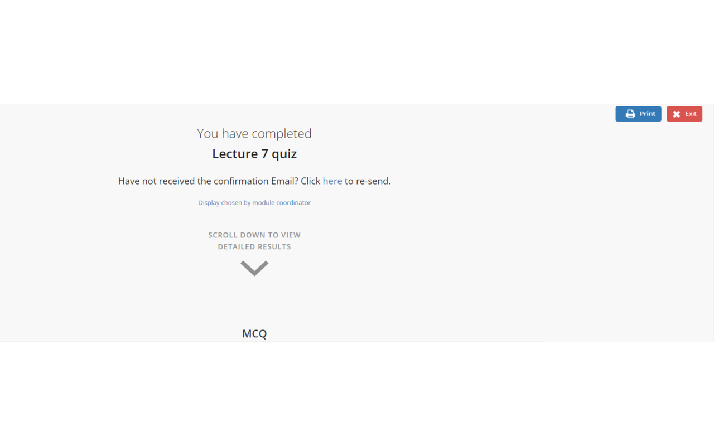
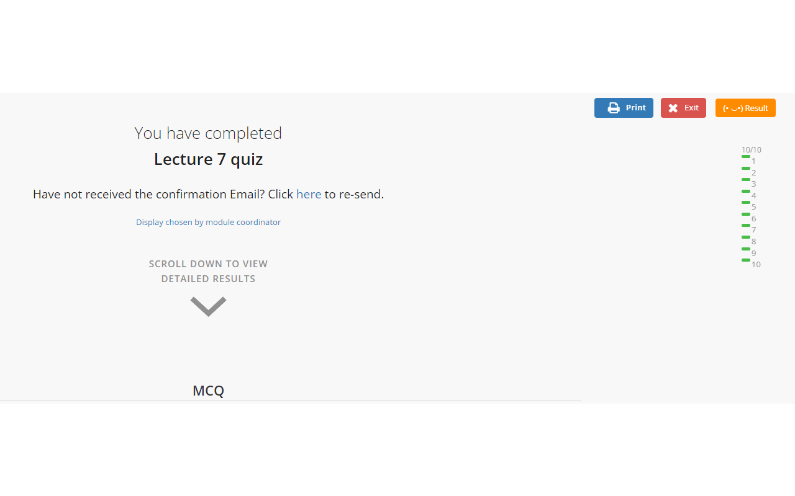

  

# Luminus Quiz Review
This simple Google chrome extension aims to help you while reviewing quizzes on LumiNUS (learning management platform), National University of Singapore.

## Description
After clicking into a quiz result page, the existing UI is such that you can only see the result of individual questions at the bottom. This plugin will adjust the styling appropriately to render a summary of your quiz result at the top right corner, allowing you to view and navigate through the page via this floating panel. This improvement in user experience is the greatest when the quiz contains over a dozen questions.

## Features
1. A 'result' button is added to the top right corner of the page to toggle the result panel. The result panel will stick to the top right corner and hence always accessible.

2. Navigate to the incorrect (or any) question that you would want to review by clicking on the small colored tile besides the question number.

## Screenshots
The first two screenshots display the current UI, while the last screenshot shows you the transformed UI with the help of this extension.

## Contribution
While this is indeed a simple extension, it has truly saved some time when I was taking the module CS2103T. It allows me to quickly navigate to questions that I got wrong and skip through questions that I have no problems with. Feel free to use it and I hope it helps you too. If you like, contribute and make it better. I regret not persuing this project further and help make LumiNUS even better, but oh well.

To contribute, simply go learn about chrome web extension development and make a PR to the github repo. I will be happy to review and merge your PR, and publish an update for this extension.